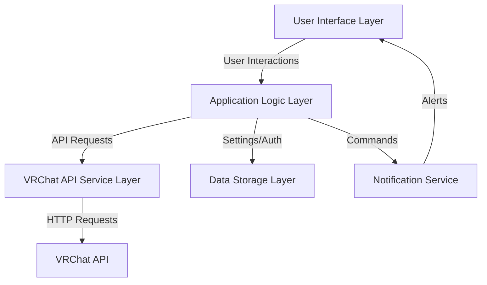
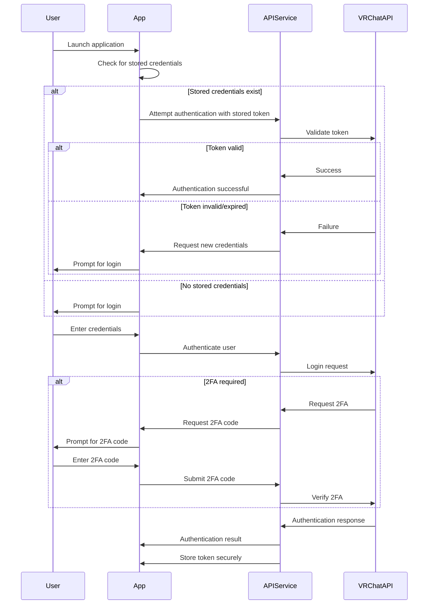
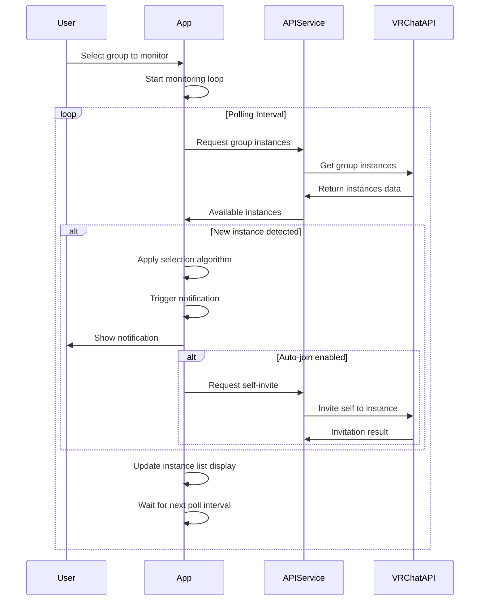

# VRChat Instance Joiner: Architecture Document

## 1. Project Overview

### 1.1 Purpose
To develop a Windows-native C# application that connects to the VRChat API, monitors group instances, and allows users to quickly join instances as they become available.

### 1.2 Key Features
- Automated monitoring of VRChat group instances
- Rapid joining of available instances
- Consistent instance selection algorithm across users
- VRChat API authentication with 2FA support
- Group querying and selection
- Customizable notifications
- Modern, attractive Windows UI
- Support for all VRChat instance types (Group, Group+, etc.)

### 1.3 Target Users
- VRChat users who need to join group instances quickly
- Users who want to coordinate joining the same instance with friends without external communication

## 2. Technology Stack

### 2.1 Core Technologies
- **Programming Language**: C# (.NET 7/8)
- **UI Framework**: WPF with MaterialDesignInXAML (modern, attractive UI with minimal effort)
- **API Communication**: VRChat API C# SDK (https://github.com/vrchatapi/vrchatapi-csharp)
- **Packaging**: Self-contained deployable executable for Windows

### 2.2 Framework Selection Rationale
WPF with MaterialDesignInXAML is recommended because:
- Native Windows framework (optimal performance and integration)
- Material Design provides a modern, clean aesthetic out-of-the-box
- Extensive documentation and community support
- XAML-based for flexible UI definition
- Rich theming support including dark/light modes
- Lower implementation complexity than custom UI design

## 3. System Architecture

### 3.1 High-Level Architecture


### 3.2 Component Breakdown

#### 3.2.1 UI Layer
- Main window with Material Design controls
- Group selection interface
- Instance monitoring display
- Settings panel
- Authentication dialog
- Notification display
- Light/dark theme support

#### 3.2.2 Application Logic Layer
- Authentication management
- Instance monitoring service
- Instance selection algorithm
- Poll frequency management and rate limiting
- User preferences management

#### 3.2.3 VRChat API Service Layer
- API client implementation
- Authentication handling (including 2FA)
- Token management and persistence
- Rate limit handling with exponential backoff
- API endpoint wrappers

#### 3.2.4 Data Storage Layer
- Secure credential storage using Windows Data Protection API
- User preferences
- Group information caching
- Instance history

#### 3.2.5 Notification Service
- Windows notification integration
- Custom sound alerts
- Visual indicators within the app

## 4. Key System Workflows

### 4.1 Authentication Flow


### 4.2 Instance Monitoring and Joining


## 5. Data Models

### 5.1 Application Settings
```csharp
public class AppSettings
{
    public bool DarkModeEnabled { get; set; }
    public int PollIntervalSeconds { get; set; }
    public bool AutoJoinEnabled { get; set; }
    public bool NotificationsEnabled { get; set; }
    public string NotificationSound { get; set; }
    public string LastSelectedGroupId { get; set; }
    public InstanceSelectionAlgorithm SelectionAlgorithm { get; set; }
}

public enum InstanceSelectionAlgorithm
{
    AlphabeticalByWorldId,
    MostRecentlyCreated,
    MostUsers,
    FewestUsers,
    Custom
}
```

### 5.2 Group and Instance Models
```csharp
public class VRChatGroup
{
    public string Id { get; set; }
    public string Name { get; set; }
    public string Description { get; set; }
    public string OwnerId { get; set; }
    public int MemberCount { get; set; }
    public bool IsJoinRequestEnabled { get; set; }
    public string IconUrl { get; set; }
    public List<string> Tags { get; set; }
}

public class VRChatInstance
{
    public string WorldId { get; set; }
    public string InstanceId { get; set; }
    public string Name { get; set; }
    public int UserCount { get; set; }
    public int Capacity { get; set; }
    public DateTime CreatedAt { get; set; }
    public InstanceType Type { get; set; }
    public string FullInstanceId => $"{WorldId}:{InstanceId}";
}

public enum InstanceType
{
    Public,
    Friends,
    FriendsPlus,
    Group,
    GroupPlus,
    GroupPublic,
    Invite,
    InvitePlus
}
```

## 6. User Interface Design

### 6.1 Main Application Window
- Material Design interface with clean, modern aesthetics
- Dark/light mode support
- Responsive layout that works well on different screen sizes

### 6.2 Key UI Components
1. **Group Selection Panel**
   - Dropdown list of user's groups with Material Design styling
   - Search/filter capability
   - Group details display

2. **Instance Monitoring Panel**
   - Live-updating list of available instances
   - Instance details (world name, user count, creation time, instance type)
   - Join button for manual joining

3. **Status Bar**
   - Connection status with visual indicators
   - Polling status and next poll countdown
   - Authentication status

4. **Settings Panel**
   - Authentication settings
   - Polling frequency with slider control
   - Notification settings
   - Instance selection algorithm options

### 6.3 Notification System
- Windows notification integration
- Custom in-app alerts with animations
- Sound notifications with customizable sounds

## 7. Security Considerations

### 7.1 Credential Storage
- Secure storage of authentication tokens using Windows Data Protection API (DPAPI)
- Optional remember me functionality
- No storage of raw passwords

### 7.2 API Communication
- HTTPS-only API communication
- Proper handling of authentication headers
- Secure token management

## 8. Performance Considerations

### 8.1 API Rate Limiting
- Intelligent backoff strategy for rate limiting
  - Starting with a reasonable poll interval (e.g., 3-5 seconds)
  - Exponential backoff when rate limits are encountered
  - Visual feedback when rate limiting occurs
- Configurable polling intervals
- Batch operations where possible

### 8.2 Resource Usage
- Minimal CPU/memory footprint
- Background operation capability
- Efficient instance filtering and matching
- Option to minimize to system tray

## 9. Implementation Plan

### 9.1 Phase 1: Core Functionality
- Basic UI implementation with Material Design
- VRChat API authentication
- Group listing functionality
- Instance monitoring and display

### 9.2 Phase 2: Advanced Features
- Notification system
- Instance joining functionality
- Settings management
- Dark/light theme support

### 9.3 Phase 3: Additional Features
- Instance selection algorithm
- History and favorites
- Statistics and metrics

### 9.4 Phase 4: Packaging and Distribution
- Windows executable packaging
- Installation guide
- Basic documentation

## 10. Testing Strategy

### 10.1 Testing Frameworks
- **xUnit**: Main testing framework for unit and integration tests
- **Moq**: For dependency mocking
- **FluentAssertions**: For readable assertions
- **WireMock.NET**: For API response mocking
- **FlaUI**: For UI automation testing

### 10.2 Unit Testing
- Test individual components in isolation
- Mock dependencies using Moq
- Focus on business logic validation
- Test algorithm correctness
- Aim for high coverage of services and view models

### 10.3 Integration Testing
- Test interactions between components
- Verify end-to-end API flows
- Test rate limit handling
- Ensure correct data flow between services

### 10.4 UI Testing
- Automated UI tests using FlaUI
- Test critical user journeys
- Verify UI state and transitions
- Test light/dark theme switching

### 10.5 Test-Driven Development
- Write tests before implementation
- Use red-green-refactor cycle
- Ensure all features have test coverage
- Maintain test suites alongside feature development

## 11. Potential Future Enhancements

1. Discord integration for notification and coordination
2. More sophisticated instance selection algorithms
3. Friend presence tracking
4. Instance analytics and statistics
5. Scheduled monitoring sessions
6. Community features (sharing settings)
7. World favorite management